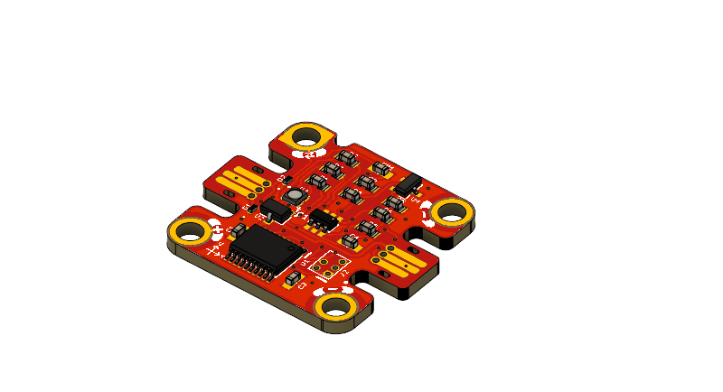
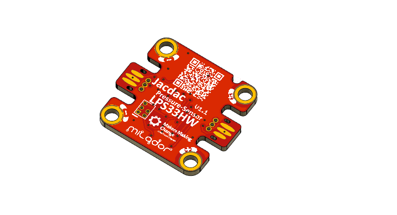

# Jacdac-3D-Magnetometer
A <a href="https://microsoft.github.io/jacdac-docs/">Jacdac</a> 3D-Magnetometer Module based on <a href="https://www.infineon.com/cms/en/product/sensor/magnetic-sensors/magnetic-position-sensors/3d-magnetics/tlv493d-a1b6/">TLV493D</a> 3-axis magnetometer sensor.

## Top View: 

## Bottom View:

